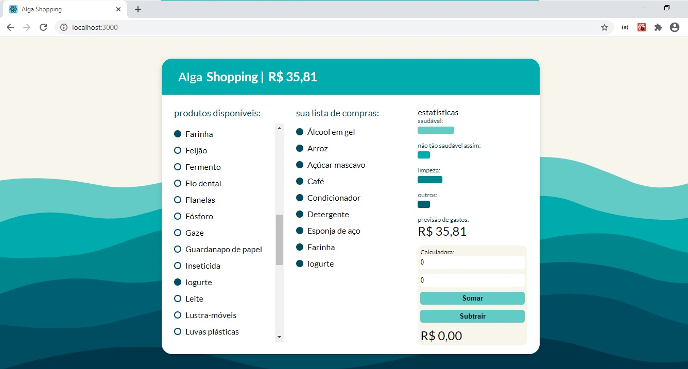
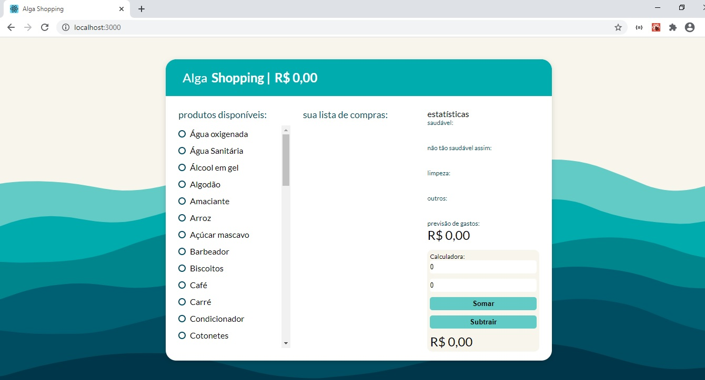

<h1 align="center">
  
</h1>

<h2 align="center">Alga Shopping</h2>
<p> 
  O <strong>Alga Shopping</strong> é uma aplicação Web de uma lista de compras com estatísticas em tempo real para prática de React, Hooks e Redux.
  
  O Projeto foi desenvolvido durante as lives do <strong>#DesafioReact</strong> da [@AlgaWorks](https://algaworks.com).
</p>

## :dart: Índice
- [Status](#status)
- [Layout](#layout)
- [Tecnologias](#tecnologias)
- [Pré-Requisitos](#pre-requisitos)
- [Executando o projeto](#executando-o-projeto)
- [Licença](#licença)

## :game_die: Status
<p align="center">
  
  
  
  
</p>

## :framed_picture: Layout




## :toolbox: Tecnologias
- [Node.js](https://nodejs.org/)
- [React](https://reactjs.org)
- [Javascript](https://www.javascript.com/)
- [Redux-persist](https://github.com/rt2zz/redux-persist/)

## :heavy_check_mark: Pré-requisitos
Antes de iniciar, certifique-se que tenha instalado em seu computador as seguintes ferramentas:
- [Node.js](https://nodejs.org/)
- [Visual Studio Code](https://visualstudio.microsoft.com/pt-br/)

## :gear: Executando o projeto

**OBS:** O projeto possui duas `branches`, que serão descritas abaixo:      
  ***-Master:*** Versão do projeto utilizando Hooks, com a lógica agrupado no arquivo principal.

  ***-Redux:*** Versão do projeto utilizando Redux, distribuindo as responsabilidades no projeto.

1. *Faça um clone do repositório:*

```sh
$ git clone https://github.com/LuizEduardoBilotta/DesafioReact
```

2. *Siga as etapas abaixo:*

```sh
# Acesse o diretório do projeto terminal:
$ cd DesafioReact

# Instale as dependências:
$ npm install

# Execute a aplicação:
$ npm start
```

**OBS:** Caso não inicie a aplicação automaticamente em seu navegador, acesse manualmente digitando na barra de endereços: `localhost:3000`

## :bookmark_tabs: Licença
Este projeto está licenciado nos termos da licença MIT. Veja o arquivo [LICENSE](./LICENSE) para mais detalhes.

## :jigsaw: Contato
- :mailbox_with_mail: E-mail: <a href="mailto:luizeduardobilotta@gmail.com">luizeduardobilotta@gmail.com</a>
- :pushpin: Linkedin: [in/luizeduardobilotta](https://www.linkedin.com/in/luizeduardobilotta)

<sup>Desenvolvido por <i><strong>Luiz Eduardo Bilotta.</i></strong></sup>
